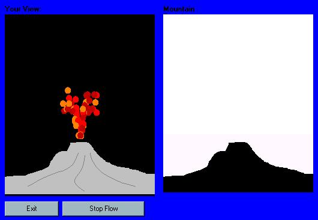



## Volcanoe Simulator

### Description

a cool volcanoe simulator that simulates volcanoes (not really). it spews out lava and then the lava dries to form terrain. please VOTE!!! and comment
 
### More Info
 

             |
---                |---
**Submitted On**   |2002-03-24 22:08:02
**By**             |[poop\_4\_brains](https://github.com/Planet-Source-Code/PSCIndex/blob/master/ByAuthor/poop-4-brains.md)
**Level**          |Intermediate
**User Rating**    |4.5 (18 globes from 4 users)
**Compatibility**  |VB 6\.0
**Category**       |[Coding Standards](https://github.com/Planet-Source-Code/PSCIndex/blob/master/ByCategory/coding-standards__1-43.md)
**World**          |[Visual Basic](https://github.com/Planet-Source-Code/PSCIndex/blob/master/ByWorld/visual-basic.md)
**Archive File**   |[Volcanoe\_S651233242002\.zip](https://github.com/Planet-Source-Code/poop-4-brains-volcanoe-simulator__1-33037/archive/master.zip)

